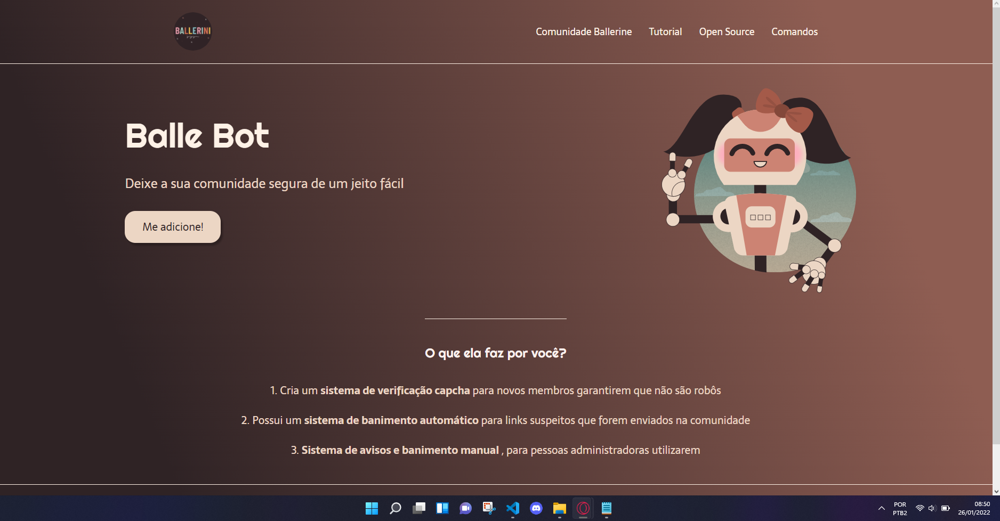

# Landing Pages - Balle Bot

     

## O Projeto

Esse projeto, refere-se ao meu treinamento em criação de páginas web utilizando HTML e CSS. Ele se chama Balle Bot e foi feito acompanhando a aula da Rafaeella Ballerini na plataforma do youtube.

## Funcionamento

### Landing Pages

São criadas para promover um determinado objetivo, como apresenta um bot, uma venda, um jogo, entre outros...

## A criação do projeto

Como parte da minha busca de conhecimento por web design comecei a praticar Landing Pages para obter e relaizar novas formas de modelagem,
é simples mais é um bom começo.
